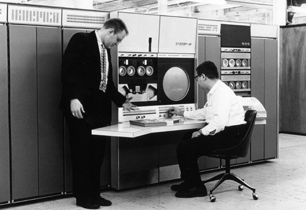
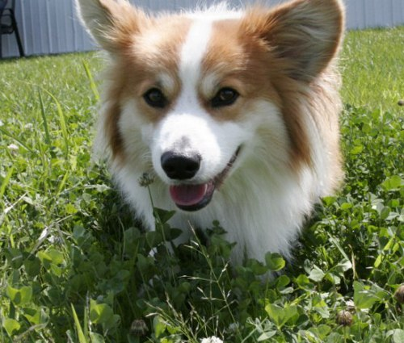
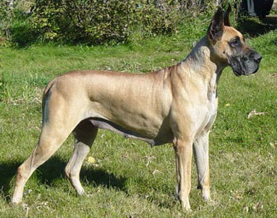

<h2> {{ page.title }} </h2>
<!-- js: js/index.js -->

In 1966, MIT professor Seymour Papert proposed a summer undergraduate project to address the nascent field of computer vision. Among its goals was to solve the now classic object recognition problem: 

> The final goal is object identification which will name objects by matching them with a vocabulary of known objects.

This didn't seem like a particularly ambitious objective at the time. The 1960s were a whirlwind era for computers, having seen them developed from vacuum tubes to essentially modern architectures in the span of twenty years. Computer vision too was making strides. Nearly a decade earlier in 1958, Cornell researcher Frank Rosenblatt demonstrated the Perceptron, a machine for automatically classifying simple images. If humans, it was reasoned, can identify shapes and objects then a computer could do the same task easily. These factors led Papert and others to conclude that computer vision would rapidly be automated---another solved problem in a rapidly growing list.

Half a century later we're still working on it.

Papert and his contemporaries failed to realize that the problem they faced was far more complex than turning pixels into labels. It's about turning pixels into abstract concepts that go beyond color, size, or geometry. These concepts challenge our understanding of how we perceive the world. What makes an object an object? Different breeds of dogs, for instance, can look remarkably different but a toddler can distinguish between a dog and cat after only having seen a few examples. 

Which of these two objects belong in the same category?

To an external observer the field has failed to deliver on decades of promises, but in the lab progress had been slow and steady. Numerous algorithms emerged from the lab to revolutionize their respective niches, like David Lowe's SIFT features or the Viola-Jones face detector. The last few years however have seen something profound. Consider the ImageNet challenge, an international competition that pits the latest object recognition algorithms against a challenging dataset. The first few years produced unremarkable results but 2012 saw the reemergance of *deep learning*, a modernization of the 1980s neural network. The technique produced stunning results and in subsequent years accuracy has improved more than in the prior half century. Results from the 2015 competition suggest that automated object recognition is now on par with human capabilities. 

    

    

        

    
    

    

<!-- 

 -->

Note the rapid improvement after the 2012 introduction of deep learning. 

As a result of this development and related ones, computer vision applications are starting to trickle into the marketplace. If you've ever deposited a check by taking a picture of it, or had Facebook autotag your images, you've seen some early commercial examples. Future applications will be even more sophisticated. Computer vision will play a significant role in self-driving cars and augmented reality, to name a few examples.

Part of the reason for these recent developments is due to improvements in algorithms. The rigid heuristics used in the 60s gave way to powerful feature descriptors and bag-of-words models which in turn evolved into the convolutional neural networks that currently predominate. Another factor is the emergence of large datasets used for training. No longer confined to toy-size datasets, researchers today have access to million of images thanks to the ubiquity of cameras and social networking. Perhaps most importantly, it is only now that computers are sufficiently powerful to emulate what comes naturally to humans. A 1960s-era PDP-6 could compute about 170,000 instructions per second. A high-end desktop computer circa 2015 is about two million times faster. It's been said that if the techniques of the past were paired with modern datasets and computers, they would have been far more successful. Perhaps Seymour Papert was not overly ambitious, simply ahead of his time. 

    

    

        

    
    

    

<!-- 

     -->

In this blog we plan to describe the trends and developments in robotics and computer vision, particularly with regards to the medical field. We have a number of interesting topics in the pipeline but if you have suggestions or topics you'd like to see, let us know.

Let's go exploring.